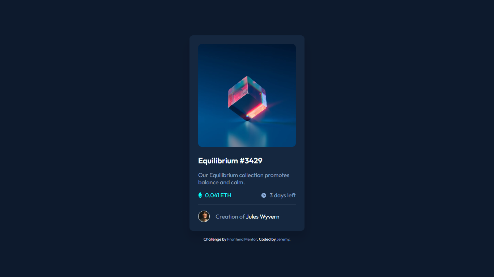

# NFT preview card component solution

This is a solution to the [NFT preview card component challenge on Frontend Mentor](https://www.frontendmentor.io/challenges/nft-preview-card-component-SbdUL_w0U). Frontend Mentor challenges help you improve your coding skills by building realistic projects.

## Screenshot

## Links

- [View Solution on Frontend Mentor](https://www.frontendmentor.io/solutions/nft-preview-card-component-01Pu2gPhgv)
- [Live Site URL](https://nft-card-0x.netlify.app/)
